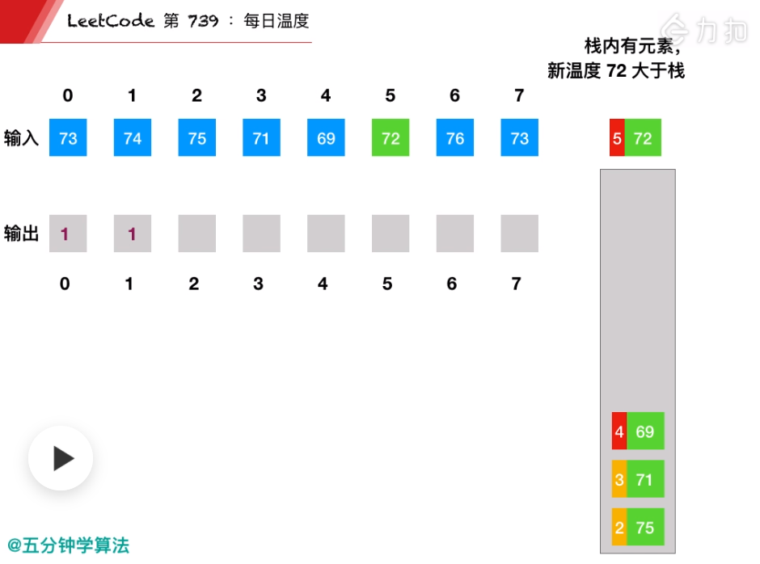
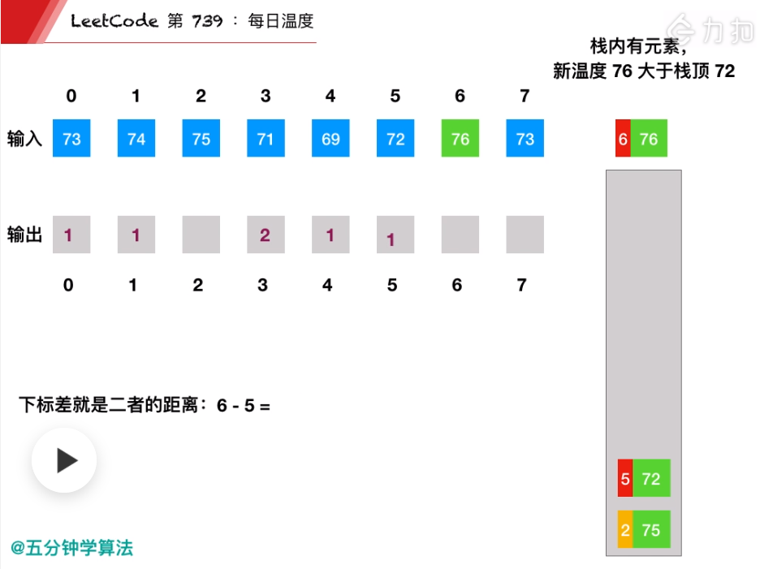
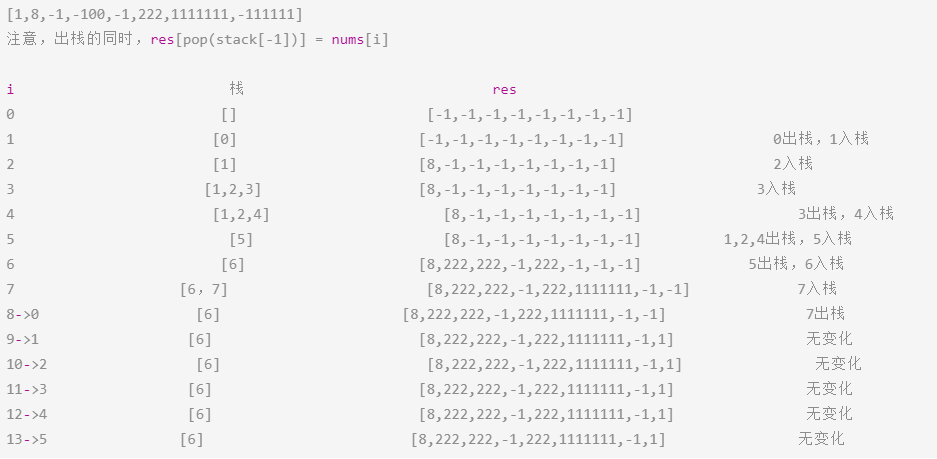

# Leetcode 题解 - 栈和队列
<!-- GFM-TOC -->
* [Leetcode 题解 - 栈和队列](#leetcode-题解---栈和队列)
    * [1. 用栈实现队列](#1-用栈实现队列)
    * [2. 用队列实现栈](#2-用队列实现栈)
    * [3. 最小值栈](#3-最小值栈)
    * [4. 用栈实现括号匹配](#4-用栈实现括号匹配)
    * [5. 数组中元素与下一个比它大的元素之间的距离](#5-数组中元素与下一个比它大的元素之间的距离)
    * [6. 循环数组中比当前元素大的下一个元素](#6-循环数组中比当前元素大的下一个元素)
<!-- GFM-TOC -->


## 1. 用栈实现队列

简单：[剑指 Offer 09. 用两个栈实现队列](https://leetcode-cn.com/problems/yong-liang-ge-zhan-shi-xian-dui-lie-lcof/)

```java
//一般不选用Stack作栈，而是选用LinkedList， 解释：
//Stack继承Vector接口，Vector底层是一个Object[]数组，且加同步锁，扩容慢。
//LinkedList实现了Deque接口，所以Stack能做的事LinkedList都能做,双向链表，扩容容易点。
LinkedList<Integer> in, out;
public CQueue() {
    in = new LinkedList<Integer>();
    out = new LinkedList<Integer>();
}
public void appendTail(int value) {
    in.addLast(value);
}
public int deleteHead() {
    if(!out.isEmpty()) 		return out.removeLast();
    if(in.isEmpty()) 		return -1;
    while(!in.isEmpty())	out.addLast(in.removeLast());
        
    return out.removeLast();
}
```

```java
public List<Integer> nums = new ArrayList<>();
public CQueue() {}
public void appendTail(int value) {nums.add(value);}
public int deleteHead() {
    if(nums.size() == 0) return -1;
    else return nums.remove(0);
}
```

```c++
class CQueue {
    stack<int> s1, s2;
public:
    void appendTail(int value) { s1.push(value); }
    int deleteHead() {
        if(s1.empty() && s2.empty())  return -1;  
        if(s2.empty()){
            while(!s1.empty()){
                s2.push(s1.top());
                s1.pop();
            }
        }
        int tmp = s2.top();//pop()返回值不能直接用来return，得用tem接一下
        s2.pop();
        return tmp;
    }
};
```

## 2. 用队列实现栈

简单：[225. 用队列实现栈](https://leetcode-cn.com/problems/implement-stack-using-queues/)

在将一个元素 x 插入队列时，为了维护原来的后进先出顺序，需要让 x 插入队列首部。而队列的默认插入顺序是队列尾部，因此在将 x 插入队列尾部之后，需要让除了 x 之外的所有元素出队列，再入队列。

核心点：就是在添加的时候，如果队列元素多余1，也就是>=2，那就将新添加元素前面的元素依次出队，再入队。这时，新添加的元素就跑到了队头。

```java
队列常用方法：
Queue<Integer> queue = new LinkedList<>();

queue.add(x); 
queue.peek(); 		// peek() ？？？是队列和栈都能通用的方法
queue.remove();		// 返回删除的元素，实际是删除 LinkedList 左边第一个
queue.size();
queue.isEmpty();
```

```java
private Queue<Integer> queue;
public MyStack() { queue = new LinkedList<>(); }

public void push(int x) {
    queue.add(x);
    int cnt = queue.size();
    while (cnt-- > 1) {				//1、2循环一次变成2、1，再次添加3，循环两次变成3、2、1
        queue.add(queue.remove());
    }
}
public int pop() { return queue.remove(); }
public int top() { return queue.peek(); }
public boolean empty() { return queue.isEmpty(); }
```

## 3. 最小值栈

简单： [面试题30. 包含min函数的栈](https://leetcode-cn.com/problems/bao-han-minhan-shu-de-zhan-lcof/)

```javascript
//定义栈的数据结构，请在该类型中实现一个能够得到栈的最小元素的 min 函数在该栈中.
//实现类中的方法,调用 min、push 及 pop 的时间复杂度都是 O(1)。
class MinStack {
    public MinStack() {}
    public void push(int x) {}
    public void pop() {}
    public int top() {}
    public int min() {}
}
```

对于实现最小值队列问题，可以先将队列使用栈来实现，然后就将问题转换为最小值栈。

```java
private Stack<Integer> dataStack = new Stack<>();
private Stack<Integer> minStack = new Stack<>();
public void push(int node) {
    dataStack.push(node);
    //注意这里的优化,也就是minStack空时候直接先放进去一个，之后有更小的值就放到栈顶。
    minStack.push(minStack.isEmpty() ? node : Math.min(minStack.peek(), node));
}
public void pop() {
    dataStack.pop();
    minStack.pop();
}
public int top() { return dataStack.peek(); }
public int min() { return minStack.peek(); }
```

```c++
stack<int> stk, stkl;
MinStack() {}				//stkl，单调栈
void push(int x) {
    stk.push(x);
    if(stkl.empty() || x <= stkl.top()) stkl.push(x);
}
void pop() {
    if(stk.top() == stkl.top()) stkl.pop();		//相等时要出去，维护单调栈
    stk.pop();
}
int top() { return stk.top(); }
int min() { return stkl.top(); }
```

## 4. 有效括号的匹配

简单： [20. 有效的括号](https://leetcode-cn.com/problems/valid-parentheses/)

```js
给定一个只包括 '('，')'，'{'，'}'，'['，']' 的字符串 s ，判断字符串是否有效。
有效字符串需满足：左括号必须用相同类型、以正确的顺序的右括号闭合。
输入：s = "()[]{}" 输出：true	 输入：s = "([)]" 输出：false 输入：s = "{[]}" 输出：true
```

```java
public boolean isValid(String s) {
    if (s.isEmpty()) return true;
    Stack<Character> stack = new Stack<>();
    for (char c : s.toCharArray()) {
        if (c == '(') stack.push(')');
        else if (c == '{') stack.push('}');
        else if (c == '[') stack.push(']');
        else if (stack.empty() || c != stack.pop())// stack.empty()处理情 "]"和空栈异常
            return false;
    }
    return stack.empty();
}
```

## 单调栈

## 5. 下一个更大元素的距离

递减栈模板：

```c
stack<int> st;				
for(int i = 0; i < nums.size(); i++){
	while(!st.empty() && st.top() > nums[i])
		st.pop();
	st.push(nums[i]);
}
```

中等： [739. 每日温度](https://leetcode-cn.com/problems/daily-temperatures/)

```js
输出为：要想观测到更高的气温，至少需要等待的天数。如果气温在这之后都不会升高，请在该位置用 0 来代替。
Input: 	[73, 74, 75, 71, 69, 72, 76, 73] 
Output: [ 1,  1,  4,  2,  1,  1,  0,  0]
```

在遍历数组时用栈把数组中的数存起来，如果当前遍历的数比栈顶元素来的大，说明栈顶元素的下一个比它大的数就是当前元素。 [视频 - 每日温度 - 每日温度 - 力扣（LeetCode） (leetcode-cn.com)](https://leetcode-cn.com/problems/daily-temperatures/solution/mei-ri-wen-du-by-leetcode-solution/) 

题解：单调栈顺序遍历，栈里面存的是老元素的下标索引值。本题是  **递减栈** ：栈里只有递减元素。 

本题单调栈解决了求数组中元素与下一个比它大的元素之间的距离的问题。下图，单调递减栈，栈底元素最大。




```java
while (!stack.isEmpty()&& nums[curIndex] > nums[stack.peek()]) {}//单调递减栈
while (!stack.isEmpty()&& nums[curIndex] < nums[stack.peek()]) {}//单调递增栈
while (!stack.isEmpty()&& nums[curIndex] <= nums[stack.peek()]) {}//也可以不严格单调递增
```



图中下一个处理的是下标为2的75，处于代码中的while循环处。

最后的76、73都在栈里面，出不来了，是最后的默认值0。

```java
public int[] dailyTemperatures(int[] nums) {
    int n = nums.length;
    int[] ret = new int[n];
    Stack<Integer> stack = new Stack<>();//栈里面放元素的索引
    for (int curIdx = 0; curIdx < n; curIdx++) {
        while (!stack.isEmpty() && nums[curIdx] > nums[stack.peek()]) {
            int preIdx = stack.pop();
            ret[preIdx] = curIdx - preIdx;
        }
        stack.push(curIdx);
    }
    return ret;
}
```

```java
public int[] dailyTemperatures(int[] T) {  //暴力
    int len = T.length;
    int[] ret = new int[len];
    for (int l = 0; l < len; l++) {
        int cur = T[l];
        for (int r = l + 1; r < len; r++) {
            if (T[r] > cur) {
                ret[l] = r - l;
                break;
            }
        }
    }
    return ret;
}
```

## 6. 下一个更大元素

简单：[496. 下一个更大元素 I](https://leetcode-cn.com/problems/next-greater-element-i/) 

```
两个 没有重复元素的数组nums1、nums2，其中nums1是nums2的子集。 返回具体的数字，不存在返回-1
输入: nums1 = [4,1,2], nums2 = [1,3,4,2].		输入:nums1 = [2,4], nums2 = [1,2,3,4].
输出: [-1,3,-1]								输出: [3,-1]
```

 没有重复元素，可以用map来做映射。 

 递增栈就是求右边第一个比自己大的元素。  递减栈就是求右边第一个比自己小的元素。 

```java
public int[] nextGreaterElement(int[] nums1, int[] nums2) {		//Java 来自 c++正序
    Map<Integer, Integer> map = new HashMap<Integer, Integer>();
    Deque<Integer> stack = new ArrayDeque<Integer>();
    for (int i =  0; i < nums2.length; ++i) {
        int num = nums2[i];
        while (!stack.isEmpty() && num > stack.peek()) {
            map.put(stack.pop(),num);
        }
        stack.push(num);
    }
    int[] res = new int[nums1.length];
    for (int i = 0; i < nums1.length; ++i) {
        res[i] = map.getOrDefault(nums1[i],-1);
    }
    return res;
}
```

```c
vector<int> nextGreaterElement(vector<int>& nums1, vector<int>& nums2) {
    stack<int> stk;												//c++正序
    unordered_map<int, int> m;		
    for (int num : nums2) {
        while(!stk.empty() && num > stk.top()) {
            m[stk.top()] = num;
            stk.pop();
        }
        stk.push(num);
    }
    vector<int> ans;
    for(int i = 0; i < nums1.size() ; ++i) {
        if (m.count(nums1[i]))    ans.emplace_back(m[nums1[i]]);
        else ans.emplace_back(-1);
    }
    return ans;
}
```

[官解](https://leetcode-cn.com/problems/next-greater-element-i/solution/xia-yi-ge-geng-da-yuan-su-i-by-leetcode-bfcoj/)：给的逆序遍历，不过正序也可以，在上边 c++

````java
public int[] nextGreaterElement(int[] nums1, int[] nums2) {
    Map<Integer, Integer> map = new HashMap<Integer, Integer>();
    Deque<Integer> stack = new ArrayDeque<Integer>();
    for (int i =  0; i < nums2.length; ++i) {
        int num = nums2[i];
        while (!stack.isEmpty() && num >= stack.peek()) {
            stack.pop();
        }
        map.put(num, stack.isEmpty() ? -1 : stack.peek());
        stack.push(num);
    }
    int[] res = new int[nums1.length];
    for (int i = 0; i < nums1.length; ++i) {
        res[i] = map.get(nums1[i]);
    }
    return res;
}
````

## 7. 循环数组的下一个更大元素

中等：[503. 下一个更大元素 II](https://leetcode-cn.com/problems/next-greater-element-ii/)

```js
输入: [1,2,1]	输出: [2,-1,2]
解释: 第一个 1 的下一个更大的数是 2；数字 2 找不到下一个更大的数； 第二个 1 的需要循环搜索，结果也是 2。
```

与 739. Daily Temperatures (Medium) 不同的是，数组是循环数组，并且最后要求的不是距离而是下一个元素。



```java
public int[] nextGreaterElements(int[] nums) {
    int n = nums.length;
    int[] next = new int[n];
    Arrays.fill(next, -1);				//默认值弄好
    Stack<Integer> pre = new Stack<>();
    for (int i = 0; i < n * 2; i++) {	//第二轮处理下栈中残余的大值。
        int num = nums[i % n];
        while (!pre.isEmpty() && num > nums[pre.peek()]) {
            next[pre.pop()] = num;
        }
        if (i < n) pre.push(i);			//只第一轮添加,单调递减栈
    }
    return next;
}
```

## 8. 接雨水

力扣困难：[42. 接雨水](https://leetcode-cn.com/problems/trapping-rain-water/)

题目描述：数组所有的值都是非负的，能装多少水，注意图中最左边是接不到水的。

```js
输入：height = [0,1,0,2,1,0,1,3,2,1,2,1]	输出：6		输入：[4,5,1,3,2]	输出：2	
```


````java
public int trap(int[] arr) {					//双指针 我理解简单点，O(n)，O(1)。
    if (arr == null || arr.length <= 2) return 0;
    int sum = 0,left = 0, right = arr.length - 1;
    int mark = Math.min(arr[left], arr[right]);	//找出左右边界的最小值作为水位高度
    while (left < right) {
        if (arr[left] < arr[right]) {			//两边界谁小谁收缩,相等无所谓
            left++;								// 如果当前标尺小于水位，则水量累加
            if (arr[left] < mark) sum += mark - arr[left];
            else mark = Math.min(arr[left], arr[right]);
        }else {									//同理
            right--;
            if (arr[right] < mark) sum += mark - arr[right];
            else mark = Math.min(arr[right], arr[left]);
        }
    }
    return sum;
}
````

题解参考：[单调栈以及其他解法](https://leetcode-cn.com/problems/trapping-rain-water/solution/xiang-xi-tong-su-de-si-lu-fen-xi-duo-jie-fa-by-w-8/)，时间复杂度：虽然 `while` 循环里套了一个 `while` 循环，但是考虑到每个元

最多访问两次，入栈一次和出栈一次，所以时间复杂度是 O(n)。  空间复杂度：O(n)。

1、当前高度小于等于栈顶高度，入栈，cur指针后移。大于等于也要入栈，只是多了计算。

2、当前高度大于栈顶高度，出栈，计算出当前墙和栈顶的墙之间宽度是多少，计算更低的墙并累加。

```java
public int trap(int[] height) {				 //单调栈，有更大的出现就把小的挤出去是递减栈
    int sum = 0,cur = 0;					 //单调栈，有更小的出现就把大的挤出去是递增栈
    Stack<Integer> stack = new Stack<>();	
    while (cur < height.length) {			 //cur是当前位置指针
        while (!stack.empty() && height[cur] > height[stack.peek()]) {
            int h = height[stack.peek()];    //下标取出元素值
            stack.pop();
            if (stack.empty()) break;		 //不计算最边界的接水：[0,1,0,2,1,0,1,3,2,1,2,1]
            int len = cur - stack.peek() - 1;//两堵墙之前的距离
            int min = Math.min(height[stack.peek()], height[cur]);
            sum = sum + len * (min - h);
        }
        stack.push(cur); 					 //存下标
        cur++; 
    }
    return sum;
}
```

## 9. 柱状图中能勾勒出的最大矩形面积

困难：[84. 柱状图中最大的矩形](https://leetcode-cn.com/problems/largest-rectangle-in-histogram/)


```
输入: 非负整数数组，[2,1,5,6,2,3]	输出: 10  解释：能勾勒出的最大矩形面积为 10 
```

```java
public int largestRectangleArea(int[] heights) {		//暴力，O(n2) 超时！
    int n = heights.length, res = 0;
    for (int i = 0; i < n; i++) {
        int left = i - 1;
        while (left >= 0 && heights[left] >= heights[i])  left--;
        int right = i + 1;
        while (right < n && heights[right] >= heights[i]) right++;
        res = Math.max(res, heights[i] * (right - left - 1));
    }
    return res;
}
```

参考：[找两边第一个小于它的值 - 柱状图中最大的矩形 - 力扣（LeetCode） (leetcode-cn.com)](https://leetcode-cn.com/problems/largest-rectangle-in-histogram/solution/zhao-liang-bian-di-yi-ge-xiao-yu-ta-de-zhi-by-powc/) 

动态规划：如果前一个不大于当前高度就把前面一个的左边最小值赋给当前值的左边最小值，dp 找左右最小值

```java
public int largestRectangleArea(int[] heights) {		//改进
    if (heights == null || heights.length == 0) return 0;
    int n = heights.length;
    int[] left_i = new int[n];
    int[] right_i = new int[n];
    left_i[0] = -1;
    right_i[n - 1] = n;
    int res = 0;
    for (int i = 1; i < n; i++) {						//dp
        int tmp = i - 1;								
        while (tmp >= 0 && heights[tmp] >= heights[i]) tmp = left_i[tmp];
        left_i[i] = tmp;								//记录下标
    }
    for (int i = n - 2; i >= 0; i--) {
        int tmp = i + 1;
        while (tmp < n && heights[tmp] >= heights[i]) tmp = right_i[tmp];
        right_i[i] = tmp;								//记录下标
    }
    for (int i = 0; i < n; i++) 
        res = Math.max(res, (right_i[i] - left_i[i] - 1) * heights[i]);
    return res;  
}
```

```js
heights：[2, 1, 5, 6, 2, 3]			//构造
left_i：[-1, -1, 1, 2, 1, 4]			//记录下标
right_i：[1, 6, 4, 4, 6, 6]			//记录下标
```

单调栈递增（不减）栈可以找到左边第一个比当前出栈元素小（包含等于）的元素。

单调栈递减（不增）栈可以找到左边第一个比当前出栈元素大（包含等于）的元素。

暴力法用于分析出，问题也符合后进先出顺序，以第 i 根柱子为最矮柱子所能延伸的最大面积。

**单调栈+哨兵技巧**：在原来数组的前后加两个 0 （或者是 0.5，比 1 严格小都行）的柱形，可以避免分类讨论。

**1、弹栈的时候，栈为空需要对栈判断，首部的哨兵可以一直在栈内，保证栈不空，因此减少了对栈为空的判断；**

**2、没有尾部哨兵时，遍历完后栈中可能还有元素，末尾的0可以清空并计算所有还在栈内的元素；**	

思路：对于一个高度，如果能得到向左和向右的边界，那么就能对每个高度求一次面积，遍历所有高度，即可得出

最大面积，使用单调栈，在出栈操作时得到前后边界并计算面积。

首先，要想找到第 i 位置最大面积是什么？是以i 为中心，向左找第一个小于 heights[i] 的位置 left_i；

向右找第一个小于于 heights[i] 的位置 right_i，即最大面积为 heights[i] * (right_i - left_i -1)。

```java
public int largestRectangleArea(int[] heights) {			//单调递减栈+哨兵(原数组前后加了0)
    int res = 0;											//2,1,5,6,2,3
    LinkedList<Integer> stack = new LinkedList<>();			//推荐
    int[] new_heights = new int[heights.length + 2];
    //这里大可换成别的方式，填充前后的 0
    for (int i = 1; i < heights.length + 1; i++) new_heights[i] = heights[i - 1];
    //System.out.println("new_heights:"+Arrays.toString(new_heights));
    for (int i = 0; i < new_heights.length; i++) {
        //System.out.println("stack:"+stack.toString());
        while (!stack.isEmpty() && new_heights[stack.peek()] > new_heights[i]) {
            int cur = stack.pop();
            res = Math.max(res, (i - stack.peek() - 1) * new_heights[cur]);
            //System.out.println("res:"+res+",");
        }	//必须是i - stack.peek() - 1 而不是 i - cur
        stack.push(i);
    }		//(5-3-1) *6     (5-2-1) *5
    //System.out.println("last-stack:"+stack.toString());
    return res;
}			//最后栈内会是最后尾部和首部0的下标出不来，不过不重要。
```

```js
new_heights:[0, 2, 1, 5, 6, 2, 3, 0]
stack:[]					//打印数据
stack:[0]
stack:[1, 0]				//栈顶最大的遇见了更小的，栈顶pop出去
res:2,
stack:[2, 0]
stack:[3, 2, 0]
stack:[4, 3, 2, 0]	 		//从左到右依次递减
res:6,
res:10,
stack:[5, 2, 0]
stack:[6, 5, 2, 0]
res:10,
res:10,
res:10,
last-stack:[7, 0]
```

```java
public int largestRectangleArea(int[] heights) {	//原始代码，包含了3中情况的处理。
    int len = heights.length,res = 0;				//单调递减栈，看起来冗余实则复用处理。
    if (len == 0) return 0;
    if (len == 1) return heights[0];
    Deque<Integer> stack = new ArrayDeque<>(len);
    for (int i = 0; i < len; i++) {
        while (!stack.isEmpty() && heights[i] < heights[stack.peekLast()]) {
            int curHeight = heights[stack.pollLast()];
            while (!stack.isEmpty() && heights[stack.peekLast()] == curHeight)
                stack.pollLast();					//处理连续相同高度计算错误的情况，不处理也对
            int curWidth;							//不处理会被后边的正确计算覆盖
            if (stack.isEmpty()) curWidth = i;		//最后一个元素的情况
            else curWidth = i - stack.peekLast() - 1;
            res = Math.max(res, curHeight * curWidth);
        }
        stack.addLast(i);
    }
    while (!stack.isEmpty()) {						//处理栈内依然有元素的情况
        int curHeight = heights[stack.pollLast()];	//和上边while的代码近似
        while (!stack.isEmpty() && heights[stack.peekLast()] == curHeight)
            stack.pollLast();
        int curWidth;
        if (stack.isEmpty()) curWidth = len;
        else curWidth = len - stack.peekLast() - 1;
        res = Math.max(res, curHeight * curWidth);
    }
    return res;
}
```


#### todo

- 求解算术表达式的结果（LeetCode 224、227、772、770)
- 求解直方图里最大的矩形区域（LeetCode 84）

[1673. Find the Most Competitive Subsequence](https://leetcode-cn.com/problems/find-the-most-competitive-subsequence/)

单调栈 ：「力扣」第 42、739、496、316、901、402、581 题。 